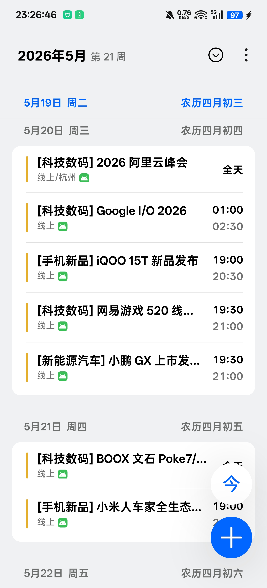
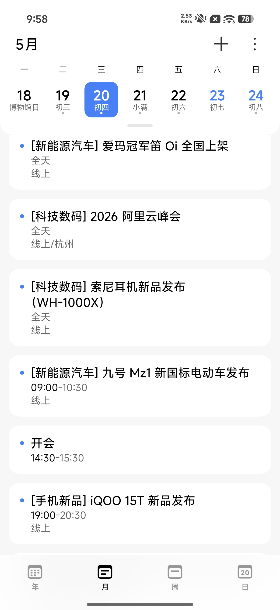
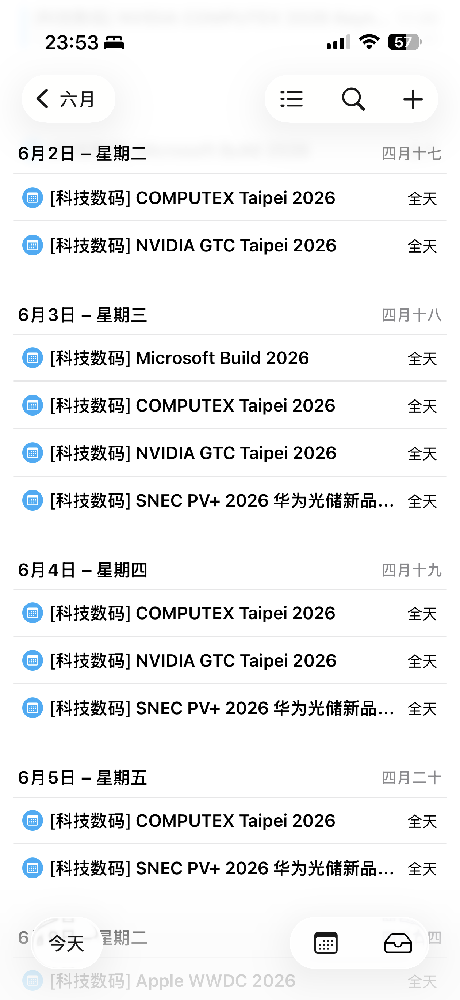

# 新品发布会日历抓取器 / Tech Launch Calendar Feed

这是一个面向科技数码、手机、电脑、新能源汽车和汽车行业发布会的日历项目。它既包含本地抓取和同步脚本，也会生成可公开订阅的 `.ics` 日历源。

默认订阅地址：

```text
https://weixunkkkkk.github.io/fabuhuizixun/out/subscription_feed.ics
```

## 覆盖范围

- 手机新品/新机发布会
- 电脑、平板、AI 硬件和消费电子发布会
- 新能源汽车/智能汽车/新车发布会
- 传统燃油车、合资品牌、日系车等汽车发布会
- 其他值得关注的科技行业活动

## 输出文件

- `out/events.html`：手机竖屏发布会清单页，默认每 5 分钟自动刷新一次
- `out/launch_events.ics`：可导入 Google Calendar 或系统日历的日历文件
- `out/subscription_feed.ics`：用于 GitHub Pages 的稳定订阅源
- `out/google_calendar_import.csv`：Google Calendar 官方 CSV 导入格式
- `out/daily_summary.csv`：每日汇总表格
- `out/daily_summary.md`：每日 Markdown 汇总
- `out/events.json`：结构化事件数据，方便后续接 API
- `out/events.csv`：表格版本
- `out/undated_candidates.json`：像发布会但日期不够明确的候选新闻

## 本地运行

在项目目录下执行：

```bash
python3 launch_calendar.py --config config.example.json
```

先跑解析自测：

```bash
python3 launch_calendar.py --self-test
```

刷新抓取结果并上传 GitHub Pages 订阅源：

```bash
python3 run_daily_upload_github.py
```

也可以双击：

```text
一键刷新并上传到GitHub.command
```

## iPhone / iPad 订阅

1. 打开 iPhone 或 iPad 的「日历」App
2. 点击底部「日历」
3. 点击「添加日历」
4. 选择「添加订阅日历」
5. 粘贴 `.ics` 订阅链接
6. 点击「订阅」并保存

添加完成后，后续发布会信息更新时，日历会按系统自己的刷新频率自动同步。

## Google Calendar 订阅

1. 打开 Google Calendar 网页版
2. 点击左侧「其他日历」旁边的 `+`
3. 选择「通过网址」
4. 粘贴 `.ics` 订阅链接
5. 点击「添加日历」

## 实测情况

目前已在 OPPO 手机、小米手机和 iPhone 上测试，均可以正常添加订阅日历并显示发布会日程。

不同系统版本的入口名称可能略有差异，只要系统日历支持网络日历、订阅日历或 URL 导入，一般都可以使用。

<h3>OPPO 手机测试截图</h3>


<h3>小米手机测试截图</h3>


<h3>iPhone 订阅测试截图</h3>


## 导入 Google Calendar

如果只是一次性导入，不做 Google 授权：

双击 `一键导入到日历.command`，它会自动刷新并打开 `out/launch_events.ics`。

如果你的 Mac 日历已经登录 Google 账号，弹窗里选择你的 Google 日历，然后点导入。

推荐优先用 `out/launch_events.ics`，它对中文和链接更稳；如果你更习惯表格导入，就用 `out/google_calendar_import.csv`。

## 同步 Google Calendar

当前用本地 Google Calendar API 同步，不依赖第三方 Python 包。

一次性授权：

1. 在 Google Cloud 里创建 OAuth 客户端，类型选 `Desktop app`。
2. 下载客户端 JSON，放到本目录并命名为 `google_client_secret.json`。
3. 执行：

```bash
python3 sync_google_calendar.py --authorize
```

以后同步：

```bash
python3 run_daily.py
```

`run_daily.py` 会先刷新抓取结果，再生成 `out/daily_summary.csv` 和 `out/daily_summary.md`。如果授权文件存在，它还会把 `out/events.json` 里的发布会创建或更新到 Google Calendar 的 `新品/科技发布会追踪` 日历里。

授权文件说明：

- `google_client_secret.json`：Google OAuth 客户端配置
- `google_token.json`：第一次授权后自动生成

这两个文件已经写进 `.gitignore`，不会被误提交。

## 同步 Mac 日历

每日自动任务会尝试把明确时间的发布会同步到 Mac 日历，目标日历名是 `科技新品发布会日程`。

第一次使用前，双击：

```text
一键授权Mac日历同步.command
```

如果系统弹出日历权限，点允许。授权后每天自动任务会自动创建或更新事件，并用 `out/mac_calendar_state.json` 防止重复创建。

## Gemini 补充数据

如果你用 Gemini 每天额外跑一遍，把结果整理成 CSV 后放到：

```text
inbox/gemini_events.csv
```

表头固定为：

```csv
title,start,end,all_day,category,location,url,source,summary
```

`start` 推荐格式：`2026-06-08 19:00`。`category` 可填：`手机新品`、`新能源汽车`、`科技数码`、`电脑新品`。

这些补充数据会自动进入同一套过滤和去重逻辑；如果和 IT之家科技日历重复，会优先保留 IT之家那条。

## 调整抓取范围

复制一份配置：

```bash
cp config.example.json config.json
```

默认每次覆盖最近 60 天抓到的消息，并只把今天前后 60 天窗口内的发布会写进日历。你可以改 `config.json` 里的 `queries`、`lookback_days`、`lookahead_days` 或 `min_score`。

`min_score` 越高，误报越少，但可能漏掉一些小品牌发布会。默认值 `3` 比较适合先用起来。

## 数据说明

本项目整理的信息来自公开渠道，包括但不限于品牌官方公告、新闻报道、发布会预热信息和公开日程。

由于部分发布会时间可能会临时调整，本项目中的日程仅供参考。建议在重要活动开始前，再以品牌官方信息为准。

## 定时任务建议

当前按每天抓一次配置。新品发布会信息一般提前几天到几周公布，这个频率比较稳。

之前在 Codex 里创建过一个名为 `每日发布会汇总并同步Mac日历` 的自动任务，按北京时间每天早上尝试刷新这个目录里的日历输出。每次都会生成 `out/daily_summary.csv` 和 `out/daily_summary.md`，并把明确时间的发布会同步到 Mac 日历。

## 维护者

Created and maintained by @微醺kkkkk.

如果你发现有遗漏、错误或需要补充的发布会信息，可以提交 Issue 或 Pull Request。
